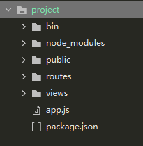

#### 1. 安装koa-generator

```bash
$ npm install -g koa-generator
```

#### 2 .使用koa-generator生成koa2项目

```bash
$ koa2  -e project(项目名称)   （-e 代表使用模板引擎ejs）
```

#### 3. 进入项目

```bash
$ cd project 
$ npm install
```

#### 4 .启动项目，默认端口号是3000

```bash
$  DEBUG=koa2-learn:* npm start        (该方法在修改文件时需要重新启动服务。不建议使用)
$  npm  run dev  （该方法可以直接刷新服务）
```

#### 5.项目目录



参考链接：<https://www.cnblogs.com/cckui/p/9958355.html> 